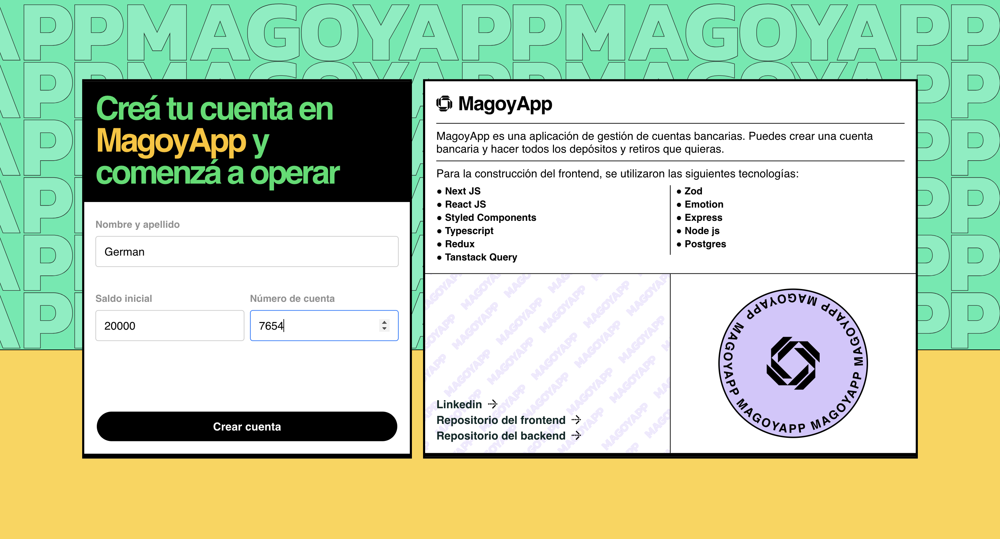
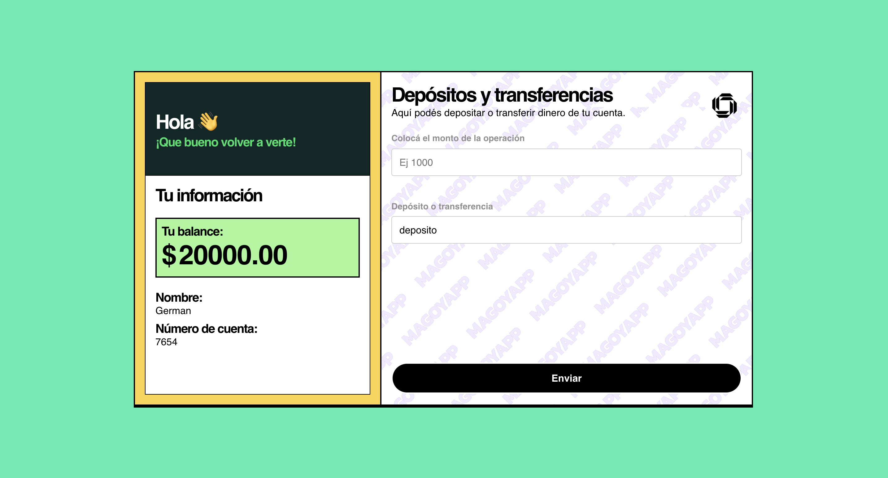

---------------------------------------------------------------------------------
---------------------------------------------------------------------------------
# Magoya Frontend
---------------------------------------------------------------------------------
---------------------------------------------------------------------------------
Frontend challenge 





## 🕺 Cómo levantar el proyecto

```bash

# Clonar el repositorio.

https://github.com/GDC94/magoya.git

# Instalar las dependencias


```bash
npm i
# or
yarn
# or
pnpm add

```

# y luego Levantar el proyecto


```bash
npm run dev
# or
yarn dev
# or
pnpm dev

```

## Tecnologías utilizadas

- [React]()
- [Next]()
- [Typescript](https://www.typescriptlang.org)
- [Styled components](https://www.typescriptlang.org)
- [zod]()
- [react hook form](https://www.typescriptlang.org)
- [React query](https://www.typescriptlang.org)
- [Redux toolkit](https://www.typescriptlang.org)

